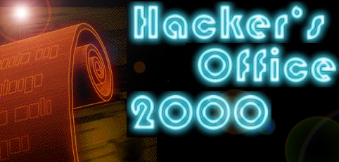



## Hacker\`s Office 2000

### Description

Hacker`s Office is a cool Aplication. You can View Pictures, Surf the Web, Test your computer, Port scanner like trojan scanner, send E-MAIL, see what is is running,CD PLAYER and much more. I would like to thanks all people that send everyday source code. Thank You.This is better then the first version it is cooooooooool
 
### More Info
 

             |
---                |---
**Submitted On**   |1999-09-24 21:24:58
**By**             |[Refik](https://github.com/Planet-Source-Code/PSCIndex/blob/master/ByAuthor/refik.md)
**Level**          |Unknown
**User Rating**    |5.0 (25 globes from 5 users)
**Compatibility**  |VB 4\.0 \(32\-bit\), VB 5\.0, VB 6\.0
**Category**       |[Complete Applications](https://github.com/Planet-Source-Code/PSCIndex/blob/master/ByCategory/complete-applications__1-27.md)
**World**          |[Visual Basic](https://github.com/Planet-Source-Code/PSCIndex/blob/master/ByWorld/visual-basic.md)
**Archive File**   |[CODE\_UPLOAD988\.zip](https://github.com/Planet-Source-Code/refik-hacker-s-office-2000__1-3693/archive/master.zip)

